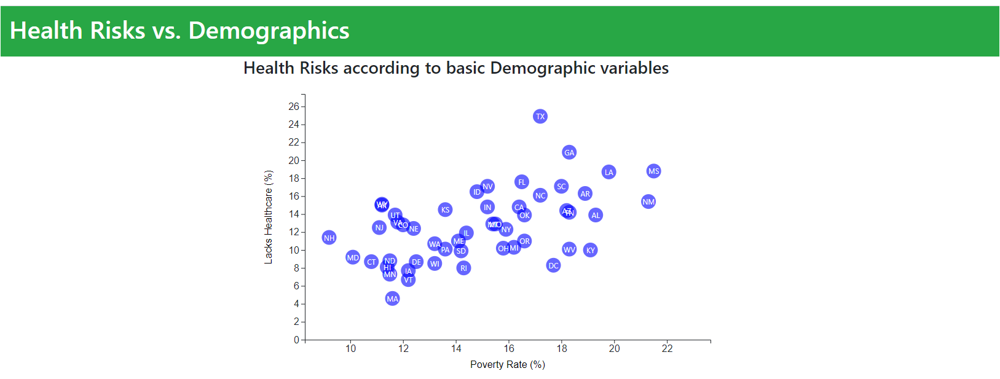
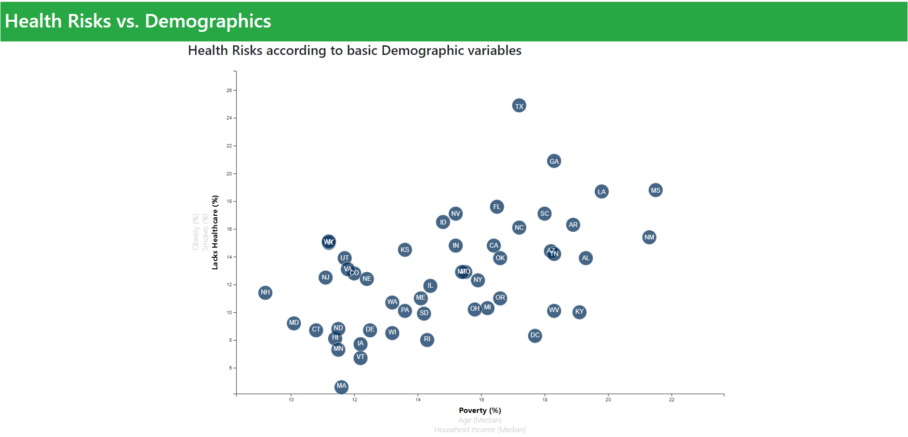
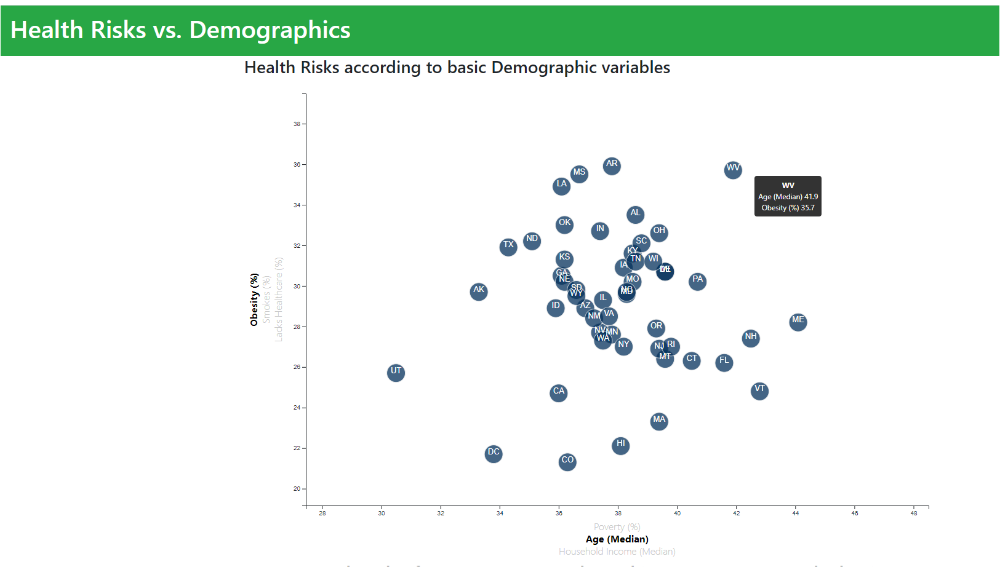
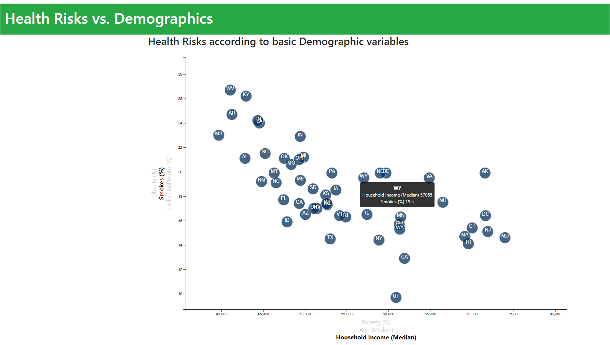
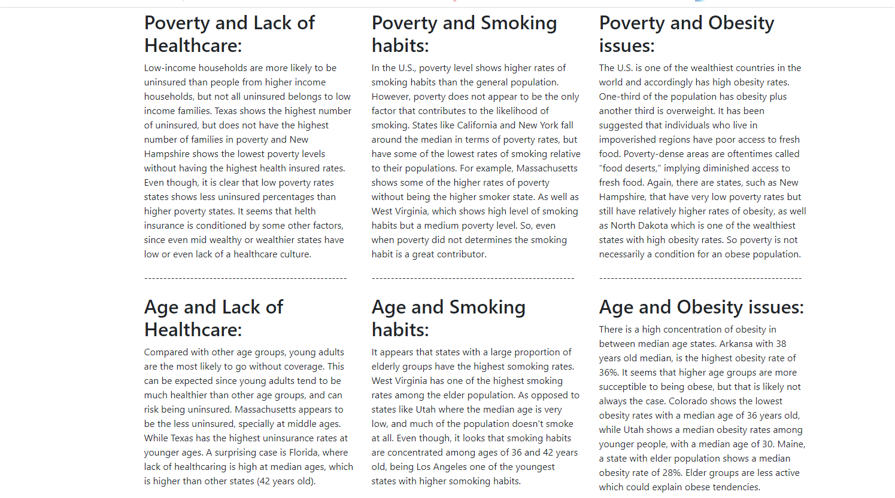

 # D3 Homework - Data Journalism and D3

## The challenge

Welcome to the newsroom! I've just accepted a data visualization position for a major metro paper. I am tasked with analyzing the current trends shaping people's lives, as well as creating charts, graphs, and interactive elements to help readers understand your findings.

The editor wants to run a series of feature stories about the health risks facing particular demographics. She's counting on me to sniff out the first story idea by sifting through information from the U.S. Census Bureau and the Behavioral Risk Factor Surveillance System.

The data set included with the assignment is based on 2014 ACS 1-year estimates: [https://factfinder.census.gov/faces/nav/jsf/pages/searchresults.xhtml](https://factfinder.census.gov/faces/nav/jsf/pages/searchresults.xhtml), The current data set includes data on rates of income, obesity, poverty, etc. by state. MOE stands for "margin of error."

### Tools for this task

1. Used  `D3-Library`

2. **html** and **Javascript** 

3. Inside your local **git repository**

4. 

5. Use the `d3-tip.js` plugin developed by [Justin Palmer](https://github.com/Caged)—we've already included this plugin in your assignment directory.

## My Task

### 1. Core Assignment: D3 Dabbler (BASIC STATIC CHART)

**CHALLENGE COMPLETED!!**

* You need to create a scatter plot between two of the data variables such as `Healthcare vs. Poverty` or `Smokers vs. Age`.

* Using the D3 techniques create a scatter plot that represents each state with circle elements. I code this graphic in the `app.js` file, which have the Basic Chart coding. Pull in the data from `data.csv` by using the `d3.csv` function. 

* Included state abbreviations in the circles.

* Create and situate your axes and labels to the left and bottom of the chart.

* Used `python -m http.server` to run the visualization. This hosted the page at `localhost:8000` in my web browser.

* Used [David Gotz's example](https://bl.ocks.org/davegotz/bd54b56723c154d25eedde6504d30ad7) to see how to implement tooltips with d3-tip.

- - -

### Bonus: Impressing my  Boss!! (UPGRADED CHALLENGE)

Why making a static graphic when D3 lets you interact with my data?

**CHALLENGE COMPLETED!!**

#### 2. More Data, More Dynamics

* Included more demographics and more risk factors.
* Placed additional labels in my scatter plot and give them click events so that your users can decide which data to display. Animated the transitions for your circles' locations as well as the range of your axes. 
* Complete the extreme challenge and create three for each axis!!!

**CHALLENGE COMPLETED!!**

* **Binded all of the CSV data to my circles**. This determine the x or y values when I click the labels.

#### 3. Incorporate d3-tip

**CHALLENGE COMPLETED!!**

* Added data layers for letting the ticks on the axes allow us to infer approximate values for each circle.

* Used tooltips in my D3 graphics to reveal a specific element's data when user hovers their cursor over the element. Added tooltips to my circles and displayed each tooltip with the data that the user has selected.

* Completed my analysis with detailed explanations about the data behaviour 

**CHALLENGE COMPLETED!!**

#### Sources
[Learn D3](https://scrimba.com/learn/d3js)

[Updating graphs in D3](https://stackoverflow.com/questions/36388122/how-to-update-a-graph-in-d3-js-when-pressing-a-button)

[D3 enter, update, exit](https://observablehq.com/@maliky/d3js-enter-update-and-exit)

[D3 dynamic button](http://www.d3noob.org/2013/02/update-d3js-data-dynamically-button.html)

- - -

### Assessment Metrics

Evaluation parameter metrics:

* Complete all steps in the core assignment

* Challenge myself with the Bonus task!

* Coherency of scatter plot (labels, ticks)

* Visual attraction

* Professionalism

* Create a **new** repository on GitHub called `D3-Challenge` 

**GREAT CHALLENGE!**

 
 

### Copyright

##### © 2020 Gabriela Loami Olivares Martinez, BootCamp Tecnologico de Monterrey.
##### © 2020 Trilogy Education Services, a 2U, Inc. brand. All Rights Reserved. 
